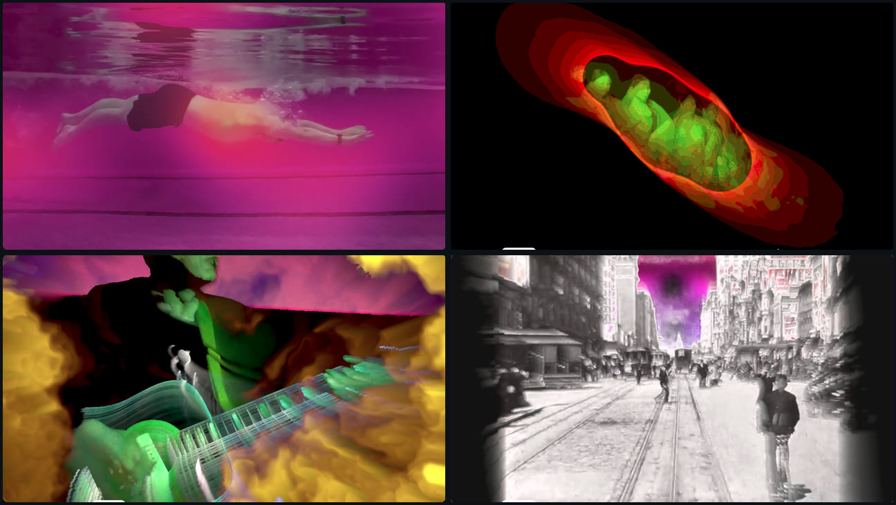
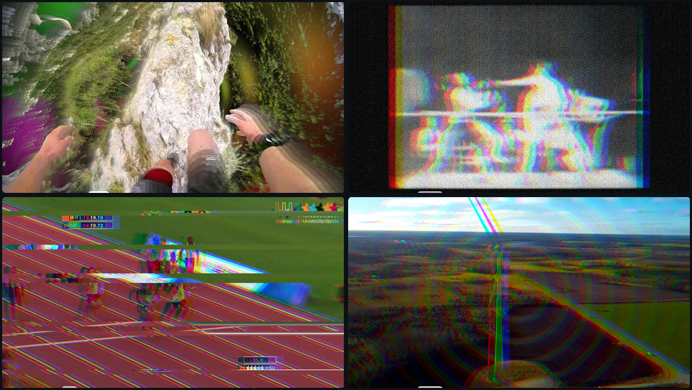

# Live Audio-Reactive Visuals

A lightweight, browser-based **audio-reactive visual engine** for live performance
and experimental recording. Works with any audio source — a DAW, music, microphone,
or direct input — and projects generative visuals full-screen on a second display.
MIDI controller compatible.

**Español:** Un motor de visuales audio-reactivos, ligero y basado en navegador,
para actuaciones en vivo y grabación experimental. Se puede usar con cualquier salida de audio (DAWs, música, micrófono, entrada directa) y proyecta
visuales generativos a pantalla completa en una segunda pantalla. Compatible con controladores MIDI.
*→ [Guía del usuario en español](USER-GUIDE.es.md).*



## Start here

**New to this? Read the [User Guide](USER-GUIDE.md).** It walks through everything in
plain language, step by step, for both **Mac and Windows** — no technical background
assumed.

### The 60-second version

You need **Google Chrome**. That's it to look around:

1. **[Open the app](https://luispsalas.github.io/live-visuals/)** in Chrome —
   `https://luispsalas.github.io/live-visuals/`
2. Click **No sound** (next to Start). Visuals start moving immediately.
3. Pick different **Source A** / **Source B** and drag the sliders.

That runs the whole engine with no audio, no setup, and nothing installed — the fastest
way to see what it does.

### To make it react to your music

A browser can't listen to your computer's audio unaided. Two ways round it:

**Option A — click "System audio" (nothing to install).** Chrome hands the app your
computer's sound through its screen-share dialog; the video is discarded immediately.
On **Windows** pick *Entire Screen* and tick **"Also share system audio"** — that
captures your DAW. On **Mac**, Chrome can only share a *browser tab's* audio, so this
covers music playing in a tab but not a DAW.

**Option B — a virtual audio cable** (needed for a DAW on Mac):

| | Install | Then |
|---|---|---|
| **Mac** | [BlackHole 2ch](https://existential.audio/blackhole/) | In *Audio MIDI Setup*, make a **Multi-Output Device** ticking BlackHole **+ your speakers**, and set it as your DAW's output — so you still hear sound. |
| **Windows** | [VB-CABLE](https://vb-audio.com/Cable/) | Set your DAW's output to **CABLE Input**. To keep hearing sound, turn on "Listen to this device" for **CABLE Output** in Sound settings, or use [VoiceMeeter](https://vb-audio.com/Voicemeeter/) instead. |

Then in the app: **Refresh → pick BlackHole (Mac) / CABLE Output (Windows) → Start**.
Play something — the meters should move.

> The Windows instructions follow standard setups but have not been tested first-hand
> yet. **No sound** works anywhere, and **System audio** installs nothing.

**Chrome will ask for permissions** — microphone (the only way a browser can receive
audio), screen-share (only for System audio; video is thrown away), and camera (only
for the Camera/Motion features). The [User Guide](USER-GUIDE.md#2-what-chrome-will-ask-permission-for-and-why)
explains each one, and *Privacy & security* below covers what the app does with them.

### To project it

Click **Open output window →**, drag that window onto your projector or second screen,
and press **f** for fullscreen. Keep the control panel on your laptop.

The in-app **How to run** panel repeats this checklist while you work.

<details>
<summary><b>Running it from source (developers)</b></summary>

Requires [Node.js](https://nodejs.org) (LTS):

```
npm install
npm run dev
```

Then open the printed URL in Chrome. `npm run build` produces a static `dist/` folder
that can be dropped on any web host — there is no server component.
</details>

## Controls

- **Audio** — choose the input (BlackHole), **Start**, then watch the bass/mid/treble/RMS meters and detected tempo. **System audio** is the no-install alternative: Chrome hands over your computer's sound via its screen-share dialog (video discarded). **No sound** runs the engine with no audio input at all, so generative sources, BPM loops and Motion keep animating — good for designing looks away from the DAW, testing the projector, or performing purely on tempo and movement. Whichever you pick, the button stays lit while it's active, and **Start** always hands back to real audio.
- **Mix & effects** — two visual **sources** (A/B) with a **crossfade**; **hue/sat** colour; **feedback** trails, **RGB shift**; a **Reactivity** mode (Punchy → Smooth → Mellow → Ambient → None) setting how strongly transients drive motion; plus **camera** and **video-file** inputs (the **Camera** dropdown picks which device — built-in, external, or a virtual cam like OBS; ⟳ rescans).
- **Degradation** — a final "make it look worse, on purpose" pass: **Glitch** (block jitter), **Pixelate** (blocks/mosaic), **Posterize** (banded colour), **Scanlines** (CRT), **Grain** (film noise). Like every parameter, each is MIDI-mappable and can be driven by Motion.
- **Compositing** — how A and B overlap: **blend modes** (add / screen / multiply / difference / …) and a **key** that reveals one feed through another. Two key modes: **Luma** (matte from brightness — or from the feedback buffer) and **Difference** (press **Capture BG** on an empty shot, and afterwards only what *changed* — you walking in — lets the other feed through; no green screen needed). **Crossfade is the master level for both the blend and the key** — at 0 neither has anything to show; the panel warns you when Key is on with Crossfade still at 0.
- **Motion** — a second input axis alongside the audio: the app frame-differences a feed, and its movement becomes a 0..1 signal you can **route onto any parameter** (with depth), stacking with the sliders and BPM loops. **Watch** picks the feed — **Camera** (tick **Enable** and it turns the camera on for you) or **Video file** (movement *within* a loaded clip drives the signal instead). Watch the meter and set **Sensitivity** for the feed you chose.
- **BPM loops** — tempo-synced motion as counterpoint to the audio reactivity: set the **BPM** (or Tap), then loop Hue / Sat / Crossfade / Feedback / Key over ¼-beat–8-bar cycles, with ramp / sine / triangle / square shapes.
- **My presets** — save and recall full looks (stored in this browser's local storage — not synced anywhere, so a different browser or computer starts empty and clearing this site's browser data erases them; number keys **1–8** fire the first eight; each is MIDI-mappable).
- **MIDI** — Connect, then **Learn** any parameter or preset onto a control. Works with any controller: pads or keyboard keys (Note On) trigger presets; knobs, faders, or the mod wheel (CC) drive parameters. Multiple devices at once are fine.
- **Output** — the top-bar button opens the projector window (**perform mode**: the panel slims down to share the screen with your DAW, and a low-power mini preview stays in the corner as a confidence monitor; close the output window to return to **design mode**, with the full-size preview). **Quality** (render scale) buys GPU headroom — see Performance below for what it actually changes.
- **Reset** — top bar, next to Open output window. Puts every look/effect control back to its default in one click (with a confirmation first). Leaves tempo, Quality, MIDI mappings, and saved presets untouched — a clean slate or panic button during a set.

**Generative sources:** Plasma, Flow field, Kaleidoscope, Tunnel, Metaballs, Voronoi, Julia, Interference — plus four **keying mattes** (Ink blobs, Strobe bars, Iris, Pulse rings: high-contrast white-on-black shapes made for luma-keying the camera or a video through them) — plus live Camera and Video file.



## Recommendations

- **Share the screen with your DAW:** the panel is a slim vertical column when the window is narrow, and flows into multiple columns when wide — just resize.
- **For tight sync,** type or tap the BPM rather than trusting the drifting auto-estimate.
- **Layer motion:** let transients drive zoom/brightness while a slow BPM loop drifts the colour — two rhythms read as more musical than one.
- **If frames drop,** see Performance below — **Quality** is the first knob to reach for.
- **Sharing one controller with your DAW:** learn the app to controls the DAW doesn't use (e.g. one pad bank for clips, the other for visuals) — the OS lets both read the same device at once, and the app only reacts to what you've learned.
- **No DAW needed to build looks:** **No sound** mode plus a tapped BPM is enough to design and save presets anywhere.

## Techniques to try

- **Keyed feeds:** Source A generative, Source B camera/video, **Screen** blend, luma-key **from Feedback** → smeary, self-referential mattes.
- **Cut yourself out of the room:** Source A generative, Source B Camera, key **from Source B**, mode **Difference** — step out of frame, hit **Capture BG**, then step back in: you appear over the generative background with the room removed. **Invert** puts the visuals on you instead.
- **Camera through a matte:** Source A = a keying matte (Ink blobs / Iris / Strobe bars / Pulse rings), Source B = Camera, luma-key **from Source A** → the camera appears only inside the moving white shapes; **invert** flips it.
- **Difference / Multiply** two generative sources for rich moiré-like overlaps.
- **Ambient** reactivity + a 4-bar **Hue** loop → slow, hypnotic colour drift for chill sets.
- **Retro decay:** **Posterize** ~0.7 + **Scanlines** ~0.5 + a little **Grain** turns any source into degraded broadcast footage. Add **Pixelate** on top for early-video-game blocks.
- **Play the visuals with your body:** route **Motion → Crossfade** at full depth — standing still holds Source A, moving pushes toward Source B. Add **Motion → Feedback** so gestures leave trails. Three rhythms at once (transients, tempo, movement) is the point.
- **Ride the mix like a fader on your DAW:** map a MIDI fader to **Crossfade** and sweep it through a breakdown, or a pad to **Glitch** for a one-hit strobe on the drop. No MIDI gear at hand? The number keys **1–8** snap between up to 8 saved looks instead.

## Performance

The app runs entirely on the GPU and is built to hold a steady frame rate for hours.
If it stutters, work down this list — the first two fix almost everything.

1. **Lower Quality** (Output module). This is the big one. **The output window always
   fills your display at its native resolution — Quality never changes that.** What it
   changes is how many pixels get shaded *before* that scale-up: at 100% every output
   pixel is computed; at 50% the GPU shades a quarter as many internally, then scales
   the result up to fill the screen. Fewer pixels shaded = fewer for the GPU to push
   every frame. Try **60–75%** on a 1080p projector, **40–50%** on 4K. The image
   softens slightly; the motion gets much smoother.
2. **Plug the laptop in.** On battery, macOS and Windows both throttle the GPU hard —
   often the single biggest cause of stutter, and the easiest to miss.
3. **Close other GPU-hungry apps** — other browser tabs (especially video), video calls,
   and anything else rendering. A second Chrome window playing YouTube competes directly.
4. **Turn off what you are not using.** **Feedback** and high **Pixelate** are the most
   expensive controls; **Motion** does a little CPU work each frame; a **camera or video
   source** costs more than a generative one.
5. **Mirror rather than extend** only as a last resort — extended displays are better for
   performing, but driving one large display is cheaper than two.

**What is already handled for you:** GPU memory is allocated once and reused, so a long
set will not creep upward; audio and motion analysis run on the audio clock, so they keep
working when the output window goes fullscreen and the control panel is hidden; and the
inline preview drops to 15 fps at half resolution automatically once you open the output
window, so you are never paying to render the same thing twice at full cost.

**Rough expectations:** a recent laptop drives 1080p at 100% Quality comfortably. For 4K,
start at 50% and raise it while watching for dropped frames. Older or integrated graphics:
start at 50% regardless of resolution.

## Recording a demo

Use **OBS Studio** with the pre-configured **"Live Visuals Demo"** scene collection and
**"Live Visuals"** profile (1080p / 60 fps, Apple hardware H.264, crash-safe MP4 to `~/Movies`,
audio straight from BlackHole — the same feed the app analyzes).

1. Start the app and open the output window (it can stay windowed — no need for fullscreen).
2. Open OBS. In the **Demo** scene, double-click **Output window** and pick the Chrome
   window titled *Live Audio-Reactive Visuals — Output* (once per session; grant Screen
   Recording permission the first time).
3. Play something in your DAW — the audio meter should move. Click **Start Recording**,
   perform, **Stop Recording**. The MP4 lands in `~/Movies`.

Tip: keep the output window at a decent size — OBS scales the capture to fit the
1080p frame, so a tiny window means a soft recording.

## Tech

Vite + Three.js (WebGL) + Web Audio + Web MIDI. Two windows: a **control panel** (keep
on the laptop, beside your DAW) analyses audio and streams state to a clean **output
window** (send to the projector) over a `BroadcastChannel`; the output window owns the
WebGL renderer. Audio analysis runs on a Web Audio clock so reactivity survives
fullscreen.

## Privacy & security

**Nothing you feed this app ever leaves your computer.** There is no server, no
account, no analytics, and no network calls of any kind — audio, camera and video are
processed locally on your GPU and discarded. Saved presets and MIDI mappings live in
your own browser's local storage — tied to this browser and computer, and gone if you
clear this site's browser data or switch to a different browser or machine.

- **Permissions:** Chrome will ask for microphone access (that is how it reads a
  virtual audio cable), screen-share access if you use **System audio** (the video is
  discarded immediately — only the audio track is kept), and camera access if you use
  the camera or Motion. All are revocable any time via the icon in the address bar.
- **MIDI** is requested without SysEx, so the app can read your controller but cannot
  reprogram it.
- **Dependencies:** the shipped app depends only on Three.js. `npm audit` reports zero
  vulnerabilities.

## Credits

The stills above are frames from the app's output, processing footage from the
Wikimedia Commons/Internet Archive:

- *A Trip Down Market Street* (1906), Miles Brothers — public domain
- *Boxing* (1892), William K. L. Dickson — public domain
- *Trail running in Spain*, Mad Jack — [CC BY 3.0](https://creativecommons.org/licenses/by/3.0)
- *Athletics Men's 200m Final*, 27th Summer Universiade 2013, FISUTV — [CC BY 3.0](https://creativecommons.org/licenses/by/3.0)
- *WikiOrchestra — Karliku (Silesian folk song)*, WikiOrchestra — [CC BY 3.0](https://creativecommons.org/licenses/by/3.0)
- *Drone video of a wind turbine near Kunda, Estonia*, Sillerkiil — [CC BY-SA 4.0](https://creativecommons.org/licenses/by-sa/4.0)
- *Butterfly stroke, from underwater*, It is a wonderful world — [CC BY-SA 4.0](https://creativecommons.org/licenses/by-sa/4.0)
- *Bagurumba, Assam's butterfly dance in motion*, JyotiPN — [CC BY-SA 4.0](https://creativecommons.org/licenses/by-sa/4.0)

None of the source footage is redistributed here — only visuals derived from it while
run through the app's effects.

## Changelog

Notable fixes, most recent first.

- **2026-08-05** — Fixed **No sound mode's BPM loops and Motion routing stalling once
  the output window took over the screen.** Its clock ran on `requestAnimationFrame`,
  which Chrome throttles hard once the control window is occluded (exactly what
  happens when the output window opens on top of it) — the real-audio path already
  avoided this by running on the audio thread instead, but No sound mode's driving
  loop was missed. Switched to `setInterval`, which isn't subject to the same
  occlusion throttling.
- **2026-08-05** — Fixed two related bugs where the output window could silently lose
  content if opened *after* setup instead of before. **Video files weren't resent to a
  window that attached late**, so Source B showed nothing there — which could look like
  "keying is broken" in any key mode, since the thing meant to be revealed was simply
  missing. **The Difference key's captured background plate lives on the GPU in
  whichever window captured it** and can't be relayed to a new one; a late-attaching
  output window now shows a warning (*"A new output window just opened — it has no
  background plate yet"*) instead of silently keying nothing. Luma key and camera-based
  sources were unaffected.

## Licence

[MIT](LICENSE) — free to use, modify, and share, including commercially; just keep
the copyright notice. Three.js and Vite are MIT too.
